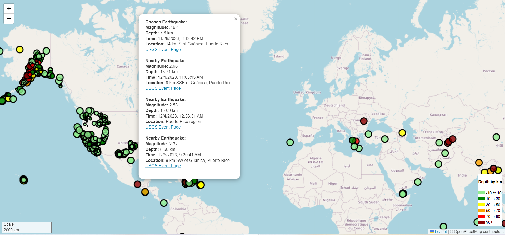

# leaflet-challenge
This website uses an api to fetch earthquake data and plot it on a global map.

The data markers should reflect the magnitude of the earthquake by their size and the depth of the earthquake by color. Earthquakes with higher magnitudes should appear larger, and earthquakes with greater depth should appear darker in color.  The closest 3 earthquakes near the chosen popup is also included.